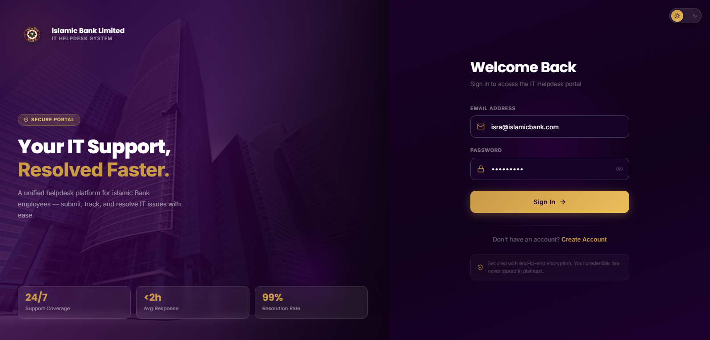
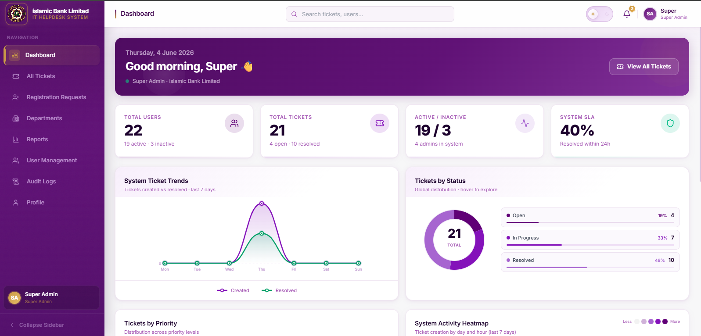
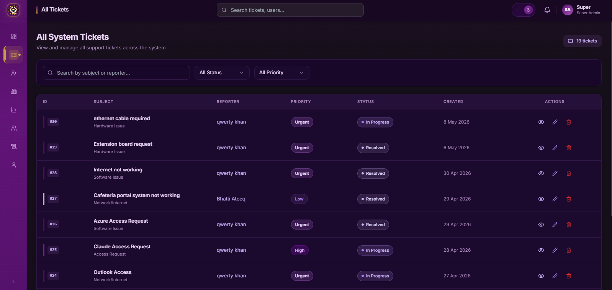
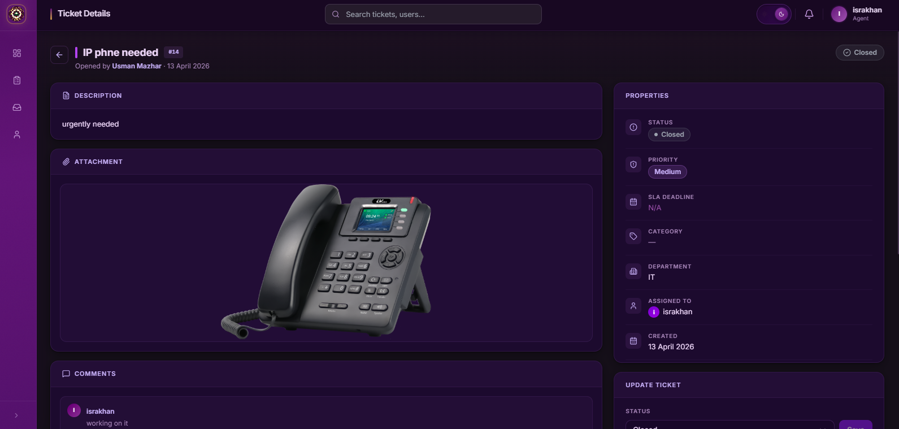
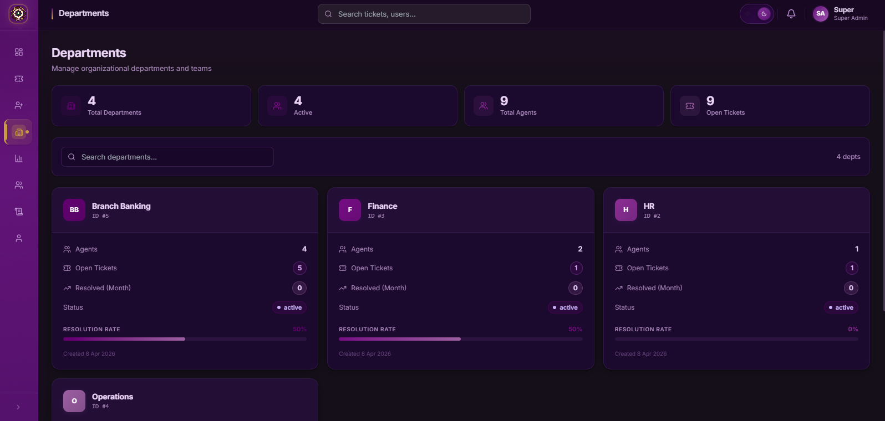
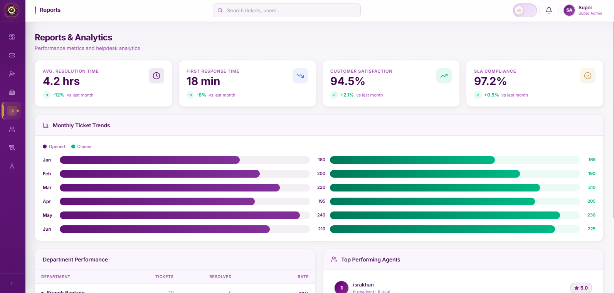
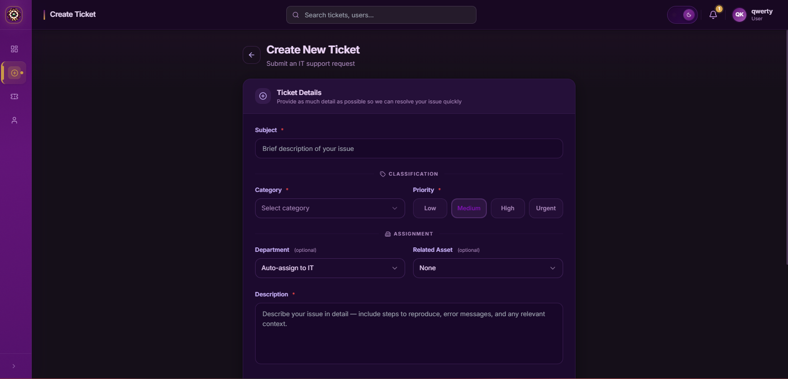
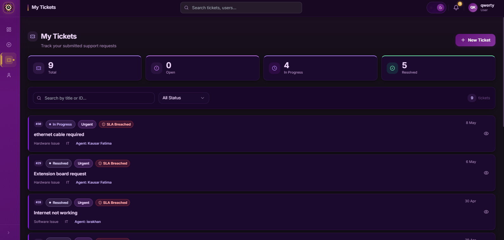
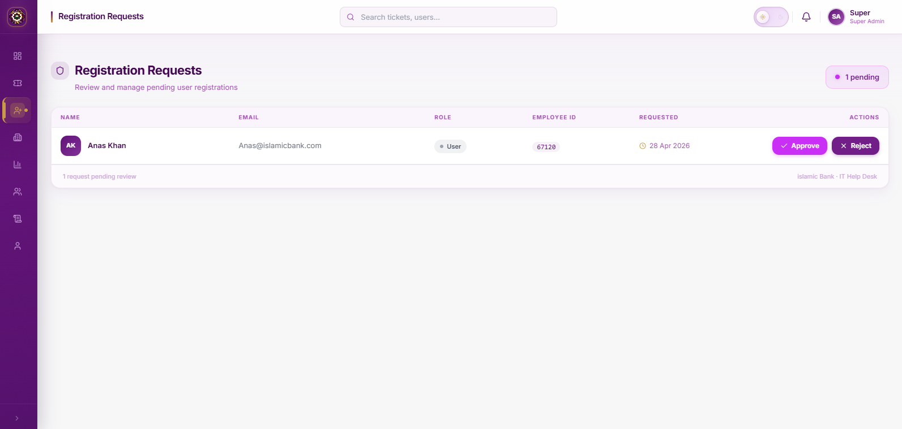

# 🏦 Islamic Bank Limited — IT HelpDesk System

A full-stack internal IT Helpdesk Management System built to streamline support operations for a bank's internal IT department — ticket creation, SLA-based tracking, role-based access control, real-time notifications, and analytics, all in one platform.


---

## 📖 Table of Contents

- [Overview](#-overview)
- [Features](#-features)
- [Tech Stack](#-tech-stack)
- [Screenshots](#-screenshots)
- [Role-Based Access Control](#-role-based-access-control)
- [Project Structure](#-project-structure)
- [Getting Started](#-getting-started)
- [Environment Variables](#-environment-variables)
- [Roadmap](#-roadmap)
- [Contributing](#-contributing)
- [License](#-license)
- [Author](#-author)

---

## 📌 Overview

**IT HelpDesk System** is a purpose-built ticketing platform for an internal banking IT department. Employees can raise support tickets, IT agents can manage and resolve queues, and administrators can monitor performance and SLA compliance through a live analytics dashboard.

Built on a modern three-tier architecture — a React/TypeScript frontend, a Node.js/Express REST API, and an MSSQL relational database — with real-time updates layered on top via Socket.io.

| Metric        | Value                |
| ------------- | -------------------- |
| Total Users   | 22                   |
| Total Tickets | 19+                  |
| User Roles    | 4                    |
| SLA Tiers     | 3 (24h / 72h / 168h) |

---

## ✨ Features

- 🎫 **Ticket Lifecycle Management** — create, classify, assign, track, and resolve support tickets end-to-end
- 🔐 **Role-Based Access Control (RBAC)** — four distinct roles with granular, enforced permissions
- ⏱️ **SLA Tracking** — automatic deadline calculation by priority, with colour-coded status (On Track / Warning / Breached)
- 🔔 **Real-Time Notifications** — instant in-app alerts via Socket.io for assignments, comments, and status changes
- 📊 **Analytics Dashboard** — live KPI cards, ticket trend charts, status distribution, and activity heatmaps
- 🗂️ **Department Management** — organize agents and tickets by department (IT, HR, Finance, Operations, etc.)
- 💬 **Ticket Comments & Attachments** — threaded discussion and file uploads per ticket
- 📝 **Audit Logging** — full compliance trail of every system action
- 🌗 **Dark / Light Mode** — theme toggle across the entire application
- 📈 **Reports & Analytics** — resolution time, first response time, satisfaction score, SLA compliance, and agent leaderboards

---

## 🛠️ Tech Stack

| Layer     | Technology                                      |
| --------- | ----------------------------------------------- |
| Frontend  | React 18, TypeScript, React Router, React Query |
| Styling   | TailwindCSS, shadcn/ui                          |
| Charts    | Recharts                                        |
| Backend   | Node.js, Express.js (MVC pattern)               |
| Database  | MSSQL + Sequelize ORM                           |
| Real-Time | Socket.io (WebSockets)                          |
| Auth      | JWT (JSON Web Tokens)                           |
| Email     | Nodemailer                                      |

---

## 🖼️ Screenshots

| Login Portal                           | Admin Dashboard                                |
| -------------------------------------- | ---------------------------------------------- |
|  |  |

| All Tickets                                | Ticket Detail                                          |
| ------------------------------------------ | ------------------------------------------------------ |
|  |  |

| Departments                                        | Reports & Analytics                        |
| -------------------------------------------------- | ------------------------------------------ |
|  |  |

| Create Ticket                                          | My Tickets                                       |
| ------------------------------------------------------ | ------------------------------------------------ |
|  |  |

| Registration Requests                                                  |
| ---------------------------------------------------------------------- |
|  |

---

## 🔐 Role-Based Access Control

| Capability               | Super Admin | Admin |       Agent        | User |
| ------------------------ | :---------: | :---: | :----------------: | :--: |
| Create Tickets           |     ✅      |  ✅   |         ❌         |  ✅  |
| View All Tickets         |     ✅      |  ✅   |         ❌         |  ❌  |
| Assign Tickets to Agents |     ✅      |  ✅   |         ❌         |  ❌  |
| Update Ticket Status     |     ✅      |  ✅   | ✅ (assigned only) |  ❌  |
| Manage Departments       |     ✅      |  ✅   |         ❌         |  ❌  |
| View Audit Logs          |     ✅      |  ❌   |         ❌         |  ❌  |

---

## 📁 Project Structure

```
islamic-Bank-Limited-IT-HELPDESK-/
├── backend/                # Node.js + Express REST API
│   ├── controllers/
│   ├── models/              # Sequelize models
│   ├── routes/
│   ├── middleware/          # Auth, RBAC guards
│   ├── services/
│   └── server.js
├── frontend/                # React + TypeScript app
│   ├── src/
│   │   ├── components/
│   │   ├── pages/
│   │   ├── hooks/
│   │   ├── context/
│   │   └── App.tsx
│   └── public/
├── docs/
│   └── screenshots/
├── .env.example
├── .gitignore
└── README.md
```

---

## 🚀 Getting Started

### Prerequisites

- Node.js (v18+)
- MSSQL Server instance
- npm or yarn

### 1. Clone the repository

```bash
git clone https://github.com/wasay-khanzada/islamic-Bank-Limited-IT-HELPDESK-.git
cd islamic-Bank-Limited-IT-HELPDESK-
```

### 2. Backend setup

```bash
cd backend
npm install
cp ../.env.example .env   # then fill in your values
npm run dev
```

### 3. Frontend setup

```bash
cd frontend
npm install
npm run dev
```

### 4. Open the app

Frontend will typically run at `http://localhost:5173` and the API at `http://localhost:5000` (confirm against your actual config).

---

## 🔑 Environment Variables

See [`.env.example`](./.env.example) for the full list. At minimum you'll need database credentials, a JWT secret, and SMTP settings for email notifications.

---

## 🗺️ Roadmap

- [ ] Mobile-responsive ticket submission flow
- [ ] Email digest for weekly SLA summaries
- [ ] Bulk ticket actions for admins
- [ ] Export reports to PDF/Excel
- [ ] Multi-language support

---

## 🤝 Contributing

Contributions, issues, and feature requests are welcome. See [`CONTRIBUTING.md`](./CONTRIBUTING.md) for guidelines.

---

## 📄 License

This project is licensed under the MIT License — see [`LICENSE`](./LICENSE) for details.

---

## 👤 Author

**Abdul Wasay Khan**
IT Department — Workflow Automation & Services Management

- GitHub: [@wasay-khanzada](https://github.com/wasay-khanzada)
